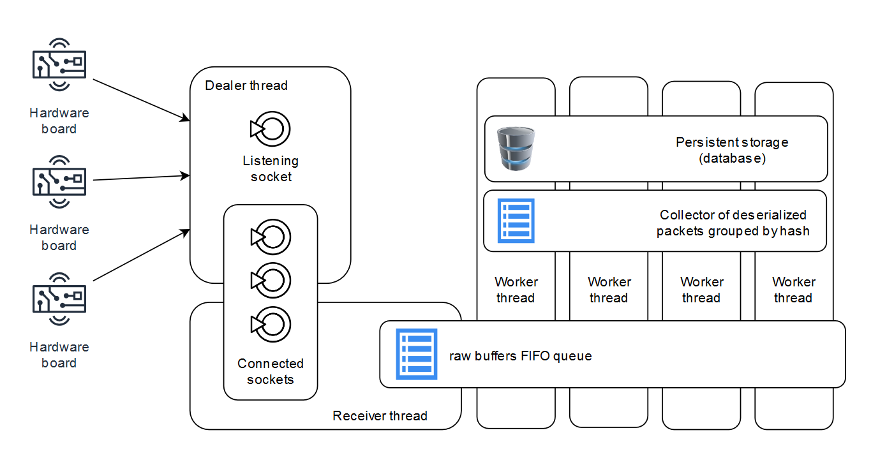

## Wifi Indoor Positioning System

### Server Architecture

- Dealer thread: listens for TCP connection requests and manages dead 
 connections.
- Receiver thread: empties sockets receiving buffers, reading raw 
 packets (not deserialized) and pushing them in a FIFO queue shared with worker threads.
- Worker thread: 
  - gets raw packets from the FIFO queue shared with the receiver, 
  - deserializes raw packets 
  - inserts packets into a packet collector
  - when given conditions are satistied performs device localization and
  - stores packets and device positions in persistent storage (SQL database).

#### Application Sub-modules

- [System Configuration](src/conf/README.md)
- [Persistent Storage (Database)](src/db/README.md)
- [Indoor Localization System](src/localization/README.md)
- [Logger](src/log/README.md)
- [Server](src/server/README.md)