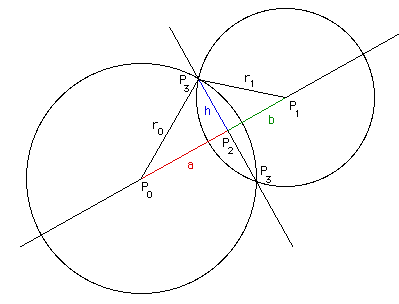

## Indoor Positioning System

The indoor positioning system uses the log-normal shadowing path loss model 
to express RSSI as distances and then uses [true range multilateration][wiki_trm] 
based on circumferences intersection and [multi-point centroid][wiki_mpc] to 
determine the position of devices.

### Circumferences intersection

[wiki_trm]: https://en.wikipedia.org/wiki/True_range_multilateration
[wiki_mpc]: https://en.wikipedia.org/wiki/Centroid